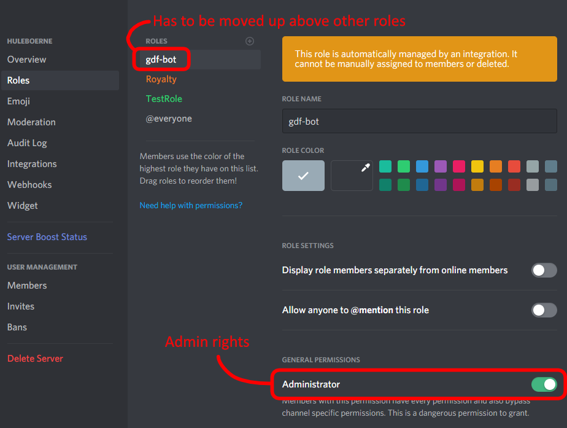

# **Game Dev Friends Bot**

A Discord bot built for the Game Dev Friends community [https://gamedevfriends.com/](). To give out milestone badges for the #100DaysOfGameDev challenge and automate roles in the Discord community.

**Note:** this bot is only designed to run on one discord server at the time.

### **Todo**
- Make daily.ts find out if you've reached a daily milestone and send a PM with the badge attached.

# **Server Setup**
Make a copy of `bot-config-example.js` named `bot-config.js` to configure the bot.

### **Run in production**
```sh
npm i
npm run build

cd ./docker
docker-compose up -d
```

### **Run in development**
```sh
npm i
npm run dev
```

# **Discord Setup**

### **Invite bot**

Invite the bot to your server (replace BOT_CLIENT_ID):

https://discordapp.com/oauth2/authorize?client_id=BOT_CLIENT_ID&scope=bot&permissions=8

### **Set bot roles**

